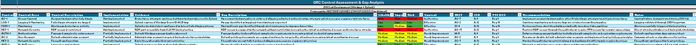
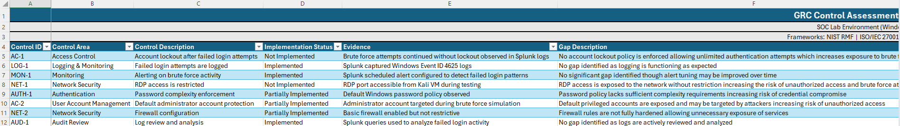
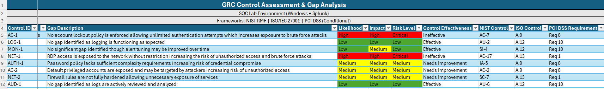
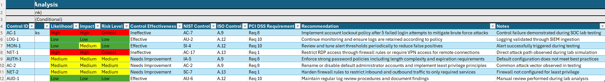
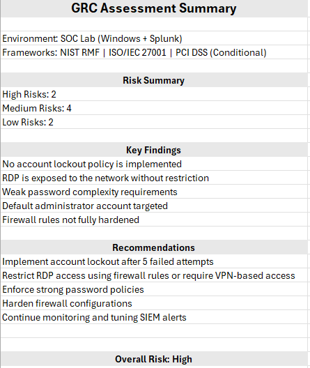

# GRC Control Assessment & Gap Analysis (NIST RMF | ISO/IEC 27001 | PCI DSS)

## Overview
This project demonstrates a control assessment and gap analysis performed on a simulated SOC environment. The objective was to evaluate security control effectiveness, identify gaps, and map controls across multiple frameworks.

The environment is based on a home SOC lab where brute force attacks were simulated and analyzed using Splunk.

---

## Environment
- Windows 10 system  
- Splunk SIEM  
- Kali Linux (attack simulation)  
- RDP exposure  
- Windows Event Logs  

---

## Methodology
This assessment followed a structured GRC approach:

- Identified relevant security controls  
- Evaluated implementation status  
- Collected evidence from the SOC lab  
- Identified control gaps  
- Assessed risk levels based on likelihood and impact  
- Mapped controls across frameworks  
- Provided remediation recommendations  

---

## Key Findings

### High Risk
- No account lockout policy is implemented  
- RDP is exposed to the network without restriction  

### Medium Risk
- Weak password complexity enforcement  
- Default administrator account exposure  
- Firewall rules are not fully hardened  

### Low Risk
- Logging and monitoring controls are effective  
- Alerting is properly configured  

---

## Framework Usage and Applicability

### NIST Risk Management Framework (RMF)
Used as the primary framework to assess and evaluate security controls and risk.

Controls applied include:
- AC-7 (Account Lockout)  
- AU-2 (Audit Logging)  
- SI-4 (System Monitoring)  
- AC-17 (Remote Access)  

NIST RMF provides a structured approach to identifying, implementing, and continuously monitoring security controls.

---

### ISO/IEC 27001
Used to align technical controls with governance and compliance standards.

Relevant control areas include:
- A.9 (Access Control)  
- A.12 (Logging and Monitoring)  
- A.13 (Network Security)  

ISO 27001 focuses on policy, governance, and continuous improvement of security posture.

---

### PCI DSS (Conditional Applicability)
Although this environment does not process cardholder data, PCI DSS is included to demonstrate how the same controls would apply in a regulated financial environment.

If this system handled sensitive financial data, the following would apply:

- Requirement 8 (Authentication and Access Control)  
- Requirement 10 (Logging and Monitoring)  
- Requirement 1 (Network Security)  

This demonstrates how security controls scale across different regulatory environments.

---

## Control Matrix

### Overview

---

### Detailed View

---

## Summary Sheet

---

## Recommendations

- Implement account lockout policy after failed login attempts  
- Restrict RDP access using firewall rules or require VPN access  
- Enforce strong password complexity requirements  
- Harden firewall configurations to limit unnecessary exposure  
- Continue monitoring and tuning SIEM alerts  

---

## Outcome

This project demonstrates:

- Control assessment and gap analysis  
- Risk identification and prioritization  
- Mapping technical controls to multiple frameworks  
- Understanding of how security controls support compliance requirements  
- Ability to translate technical findings into GRC-focused recommendations  

---

## Related Project

This assessment is based on a SOC lab where brute force attacks were simulated and detected using Splunk:

https://github.com/DakotaStone/home-soc-lab-splunk-bruteforce-detection
